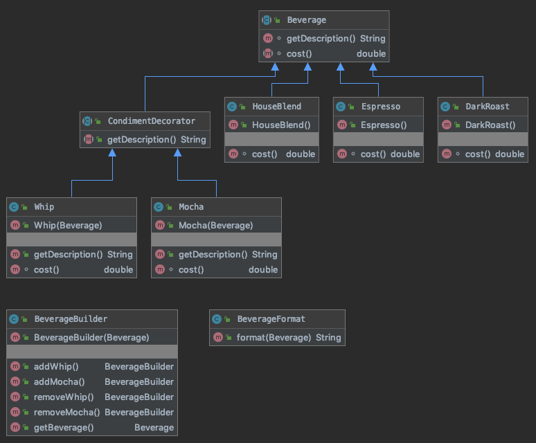

# patterns-decorator

Sample code for using a decorator and a builder.

## Build and run

```
mvn package
java -cp target/decorator-1.0-SNAPSHOT.jar com.github.lfetsch.patterns.decorator.App
```

## Class diagram


